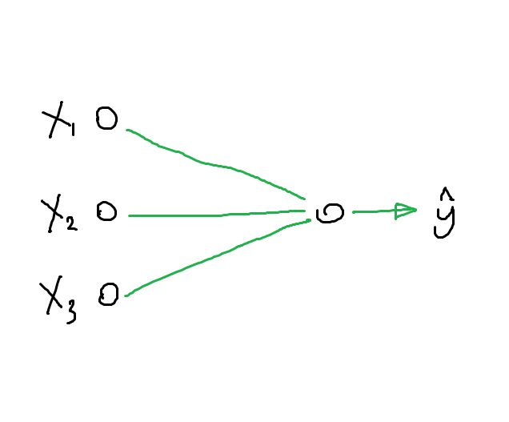
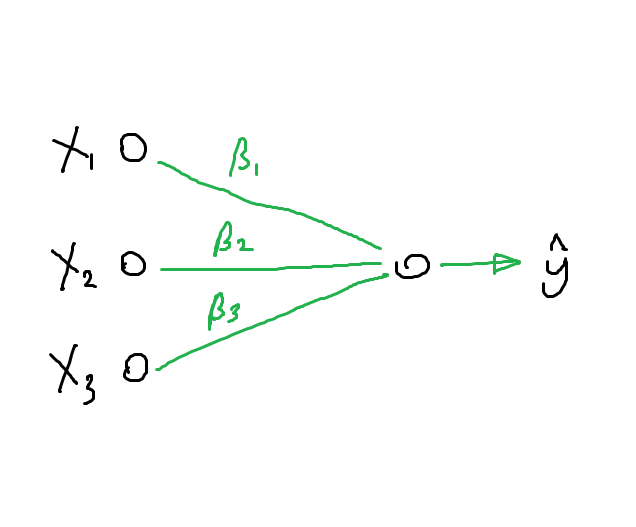
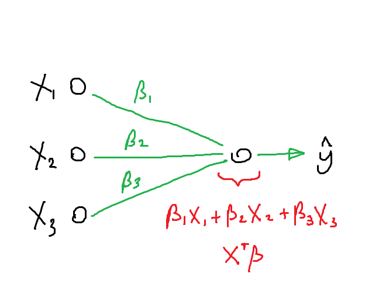

% Neural Networks
% Declan Groves
% June 30, 2016

## Overview

- Hypest ML
- Good at unstructured probelms
- Suboptimal at structured problems

## History

- Around since the 1950s
- Resurgence in 1970s
- Resurgence in late 2000s

## What is a neural network

## What is a neural network

## What is a neural network

## What is a neural network

